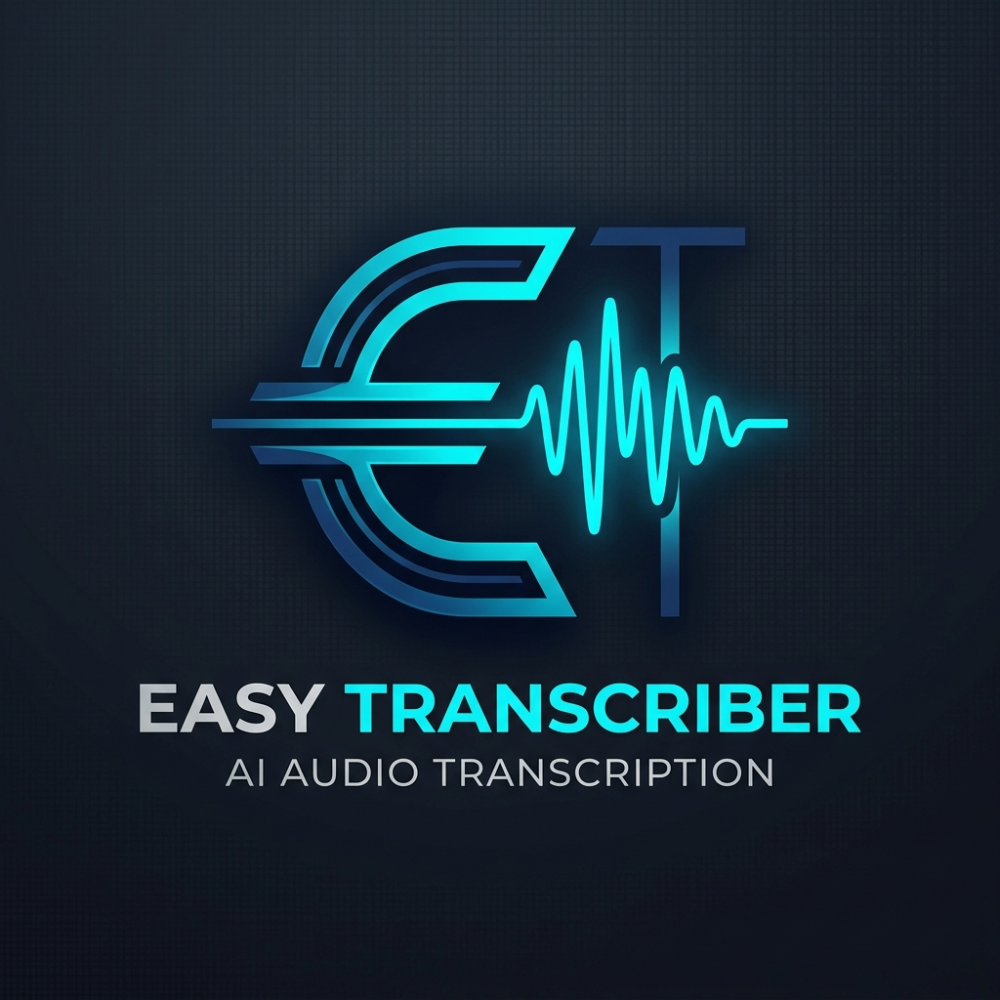

# 🎙️ Easy Transcriber

**Easy Transcriber** is a powerful, fully offline desktop application designed for high-accuracy audio transcription, speaker diarization, and semantic analysis. Built for privacy and performance, it turns your local machine into a cognitive extraction engine.

---

## ✨ Key Features

- 🔒 **100% Offline:** Your data never leaves your computer. No API keys, no subscriptions.
- 🎙️ **Real-time Microphone Transcription:** Record and transcribe your voice instantly, saving chunks directly to your disk with auto-silence detection.
- 🗣️ **Speaker Diarization:** High-precision adaptive utterance-chunked diarization for accurate turn-taking in fast dialogs.
- 🧬 **Voice Fingerprinting:** Persistently identifies speakers across different files and sessions using AHC clustering.
- 🧠 **Semantic Clustering:** Groups transcript segments by meaning to help you find what matters.
- 🌍 **Multilingual Support:** High-quality transcription for English, Russian, Tagalog, and more.
- 📂 **Multi-format Support:** Handles MP4, MKV, AVI, MP3, WAV, and FLAC.
- 📝 **Structured Export:** Generates beautiful Markdown, JSON, and SRT files.

---

## 🚀 Quick Start (Windows)

Getting started is as easy as two clicks:

1. **Setup:** Double-click `setup.bat`. This will create a virtual environment and install all necessary dependencies automatically.
2. **Launch:** Double-click `run.bat` to start the application.

> [!IMPORTANT]
> **Requirement: FFmpeg**
> Easy Transcriber requires FFmpeg for audio processing. If the setup script doesn't detect it, please download it from [ffmpeg.org](https://ffmpeg.org/) and add it to your system PATH.

---

## 🛠️ Tech Stack

- **Core Engine:** Faster-Whisper (ASR), SpeechBrain (Diarization)
- **Intelligence Layer:** Sentence-Transformers, Scikit-learn (AHC Clustering)
- **GUI:** PySide6 (Qt)
- **Processing:** FFmpeg, PyTorch

---

## 📂 Project Structure

- `app/gui/`: The visual interface components.
- `app/core/`: The engines for audio, transcription, and diarization.
- `app/voice_db/`: Local database for stored voice fingerprints.
- `app/output/`: Where your transcripts and analysis are saved.

---

## 🛡️ License

This project is part of the **Neuromicon** ecosystem. See `tech.md` for detailed technical specifications.

---

*Made with ❤️ for cognitive researchers and power users.*
