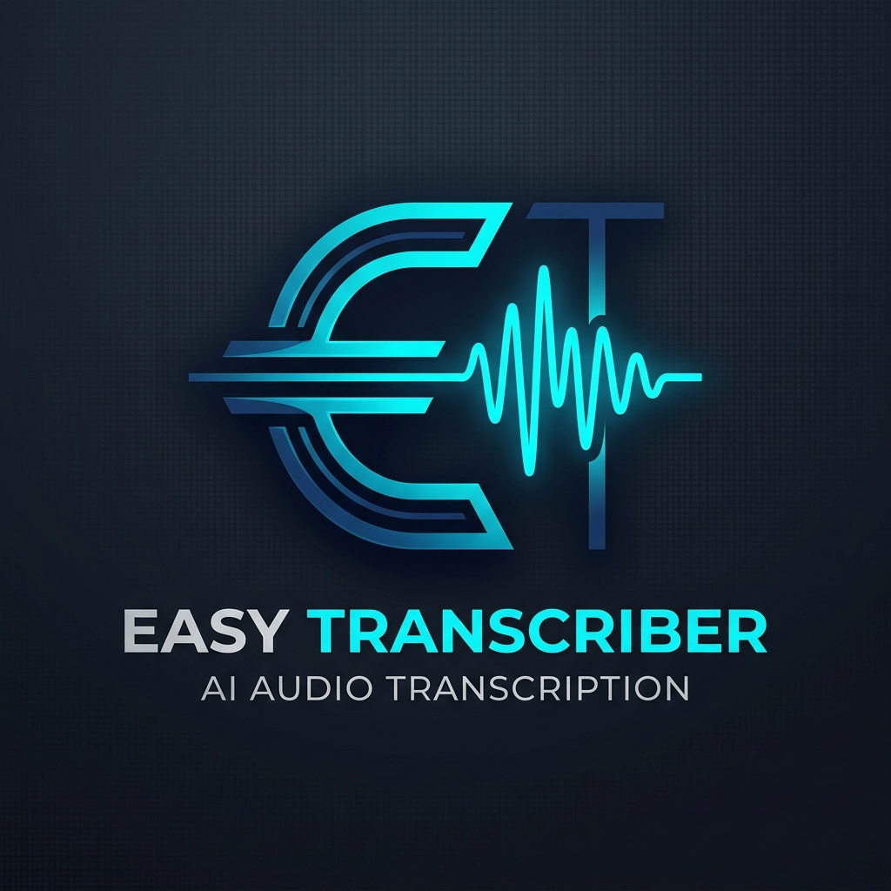

# 🎙️ Easy Transcriber



**Easy Transcriber** is a powerful, fully offline desktop application for high-accuracy audio/video transcription, speaker diarization, and voice fingerprinting. Built for privacy and performance — your data never leaves your machine.

---

## ✨ Key Features

- 🔒 **100% Offline** — No API keys, no cloud, no subscriptions. Everything runs locally.
- 🎙️ **Real-time Microphone Recording** — Capture live speech with automatic silence detection (VAD), saving chunks instantly to disk.
- 🎬 **MP4 / Video to WAV Converter** — Built-in converter: drop any MP4, MKV, or AVI file and get a clean WAV ready for transcription.
- 🗣️ **Speaker Diarization** — Adaptive utterance-chunked agglomerative clustering for accurate turn-taking even in fast-paced dialogs.
- ⚧ **Gender Detection** — Automatically identifies whether each speaker is Male or Female using offline **pitch (F0) analysis** via `scipy`. Works without any additional downloads — no internet required.
- 🧬 **Voice Fingerprinting** — Identifies speakers per file using ECAPA-TDNN embeddings (SpeechBrain). The speaker database is automatically reset before each new transcription to ensure clean, accurate identification every run.
- 🧠 **Semantic Clustering** — Groups transcript segments by meaning (optional, configurable).
- 🌍 **Multilingual** — High-quality transcription for English, Russian, Tagalog, and many more via Faster-Whisper.
- 📂 **Multi-format Input** — MP4, MKV, AVI, MP3, WAV, FLAC.
- 📝 **Structured Export** — Generates Markdown output files automatically with speaker gender labels and timestamps.

---

## 🚀 Quick Start (Windows)

1. **Setup:** Double-click `setup.bat` (Recommended)
   - Creates a Python virtual environment (`.venv`)
   - Installs all dependencies from `requirements.txt`
   - Checks for FFmpeg on your PATH

2. **Launch:** Double-click `run.bat` (or `python app.py`)
   - The launcher is smart: it automatically detects and activates `.venv` (whether built via Windows `Scripts` or Linux-style `bin`), or safely falls back to your global Python environment if you prefer managing dependencies yourself.

> [!IMPORTANT]
> **FFmpeg is required** for audio/video processing.
> Download from [ffmpeg.org](https://ffmpeg.org/) and add the `bin/` folder to your system PATH.

---

## ⚙️ Configuration

All settings are in `app/config/config.yaml`:

```yaml
asr:
  model_size: "medium"   # tiny | base | small | medium | large-v3
  device: "auto"          # cpu | cuda | auto
  language: "auto"        # auto | ru | en | ...

diarization:
  enabled: true
  min_speakers: 1
  max_speakers: 10

voice_fingerprint:
  enabled: true
  threshold: 0.65         # similarity threshold for speaker matching

semantic_clustering:
  enabled: false          # set true to group segments by meaning
  method: "kmeans"        # kmeans | hdbscan
  max_clusters: 8

paths:
  output_dir: "app/output"
  temp_dir: "app/temp"
  chunk_duration: 1800    # max chunk size in seconds (30 min)
```

---

## 📂 Project Structure

```
Easy_transcribe/
├── app/
│   ├── config/
│   │   └── config.yaml          # All runtime settings
│   ├── core/
│   │   ├── audio_processor.py   # FFmpeg wrapper, chunking, MP4→WAV conversion
│   │   ├── transcriber.py       # Faster-Whisper ASR engine
│   │   ├── voice_fingerprint.py # SpeechBrain ECAPA-TDNN + wav2vec2 gender detection
│   │   ├── mic_recorder.py      # Real-time microphone capture with VAD
│   │   ├── semantic_engine.py   # Sentence-transformer clustering
│   │   └── exporter.py          # Markdown export with gender-aware speaker labels
│   ├── gui/
│   │   └── main_window.py       # PySide6 main UI
│   ├── pipeline/                # Processing pipeline orchestration
│   ├── models/                  # Cached local model files
│   ├── voice_db/                # Session-scoped speaker fingerprint DB (auto-cleared each run)
│   └── output/
│       ├── Converted/           # MP4→WAV conversion results
│       └── <session folders>/   # Transcripts per file/session
├── app.py                       # Entry point
├── setup.bat                    # One-click environment setup
├── run.bat                      # One-click launcher
├── requirements.txt
└── tech.md                      # Detailed technical specification
```

---

## 🛠️ Tech Stack

| Layer | Technology |
|---|---|
| **ASR Engine** | [Faster-Whisper](https://github.com/SYSTRAN/faster-whisper) (CTranslate2 backend) |
| **Speaker Diarization** | SpeechBrain · ECAPA-TDNN · AHC Clustering |
| **Voice Fingerprinting** | `speechbrain/spkrec-ecapa-voxceleb` |
| **Gender Detection** | Offline pitch/F0 analysis (`scipy.signal.welch`) — no download required |
| **Semantic Analysis** | Sentence-Transformers · Scikit-learn |
| **GUI** | PySide6 (Qt6) |
| **Audio/Video** | FFmpeg · PyDub · sounddevice · webrtcvad |
| **Deep Learning** | PyTorch (CPU/CUDA) |

---

## 📤 Output Format

Each transcription produces a Markdown file in `app/output/`:

```
**00:00:05** (Male Speaker 001): Привет, как дела?

**00:00:08** (Female Speaker 002): Всё хорошо, спасибо!
```

Converted videos land in `app/output/Converted/` as `.wav` files.

---

## 🛡️ License

MIT License — see [`LICENSE`](LICENSE) for details.

This project is part of the **Neuromicon** ecosystem. See [`tech.md`](tech.md) for full technical specifications.

---

*Made with ❤️ for researchers, journalists, and power users.*
